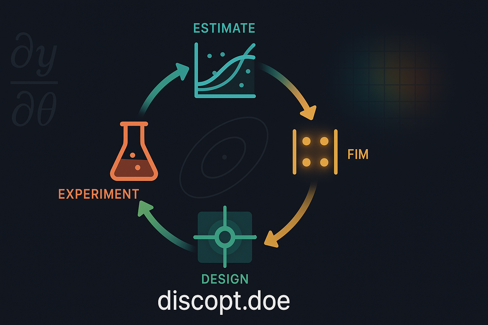

# discopt-doe



[](https://github.com/jkitchin/discopt-doe/actions/workflows/ci.yml)
[](https://pypi.org/project/discopt-doe/)

Design-of-experiments plugin for the [discopt](https://github.com/jkitchin/discopt)
modeling language. Installs as the `discopt.doe` namespace package — code written
against `from discopt.doe import ...` works unchanged.

Three complementary entry points:

1. **"What is the best operating condition?"** — active-learning optimization:
   fit a surrogate to completed experiments, recommend the next batch via an
   acquisition function (EI, UCB, steepest ascent), track everything in an
   Excel workbook.
2. **"Does this factor matter?"** — classical designs: 2-level full/fractional
   factorials, mixture designs, Latin/Graeco-Latin squares, main-effect
   estimates, ANOVA.
3. **"How precisely can I estimate the model parameters?"** — model-based DoE:
   exact D/A/E-optimal design from the Fisher Information Matrix (JAX
   autodiff), identifiability/estimability diagnostics, profile likelihood,
   model discrimination, sequential estimate–design loops.

Parameter estimation (`discopt.estimate`) lives in the base package; both
share the same `Experiment` interface.

## Try it without installing anything

**[jkitchin.github.io/discopt-doe/app/](https://jkitchin.github.io/discopt-doe/app/)**
runs the design workflow in your browser — pick a design, download the
spreadsheet, fill in your measurements, upload it back for fitting and ANOVA.
It is Pyodide running the real package, not a reimplementation, and the
workbooks it produces are the same ones the CLI reads. Nothing leaves your
machine. See [docs/browser-app.md](docs/browser-app.md).

## Install

Both `discopt-doe` and its `discopt` dependency are published on
[PyPI](https://pypi.org/project/discopt-doe/), so a plain pip install resolves
everything:

```bash
pip install discopt-doe            # core
pip install "discopt-doe[gui]"     # + Streamlit workbook GUI
pip install "discopt-doe[ml]"      # + scikit-learn surrogates
```

Or with uv:

```bash
uv pip install "discopt-doe[gui]"
```

Requires `discopt>=0.6` (the first release with the public
`discopt.parametric` API and the CLI plugin hook); it is pulled in
automatically.

From source, to work on the package itself:

```bash
git clone https://github.com/jkitchin/discopt-doe
cd discopt-doe
uv sync --all-extras        # core + gui + ml + dev
```

## Quick start

FIM-based optimal design:

```python
from discopt.doe import compute_fim, optimal_experiment, DesignCriterion

fim = compute_fim(experiment, param_values={"k": 2.0}, design_values={"T": 350.0})
design = optimal_experiment(
    experiment,
    param_values={"k": 2.0},
    design_bounds={"T": (300, 400)},
    criterion=DesignCriterion.D_OPTIMAL,
)
print(design.summary())
```

Active-learning round against a workbook:

```python
from discopt.doe import optimize_round, OptimizationCriterion

result = optimize_round(
    workbook="opt.xlsx",
    criterion=OptimizationCriterion.MAXIMIZE,
    surrogate="gp",
    acquisition="expected_improvement",
    batch_size=4,
)
print(result.next_designs)
```

Identifiability diagnostics before you spend beam time:

```python
from discopt.doe import diagnose_identifiability, estimability_rank

diag = diagnose_identifiability(experiment, param_values)
est = estimability_rank(experiment, param_values)
```

## Command line

Installing this package adds the `doe` subcommand to the base discopt CLI
(via the `"discopt.cli"` entry-point group):

```bash
discopt doe templates                 # list workbook templates
discopt doe new linear -o run.xlsx --input T:300:400 --n 8
discopt doe status run.xlsx
discopt doe fit run.xlsx              # fit parameters to completed rows
discopt doe anova run.xlsx           # ANOVA F-table (latin/factorial designs)
discopt doe extend run.xlsx --n 4     # design the next batch
discopt doe optimize run.xlsx        # one active-learning round (optimize template)
discopt doe gui run.xlsx              # Streamlit GUI (needs [gui] extra)
```

Classical designs over a continuous factor box — space-filling, or built for a
quadratic response surface — need no model up front:

```bash
discopt doe new latin-hypercube   -o lhs.xlsx --input T:300:400 --input P:1:5 --n 12
discopt doe new central-composite -o ccd.xlsx --input T:300:400 --input P:1:5
discopt doe new box-behnken       -o bbd.xlsx --input T:300:400 --input P:1:5 --input F:0.1:2
```

`fit` estimates the recorded basis (`--basis linear|quadratic`) by least
squares, so a Box-Behnken or central-composite campaign goes straight from
`new` to `fit` with no model definition. Central-composite keeps every run
inside the bounds you give by default; pass `--outside-bounds` for the textbook
scaling where the axial points sit beyond them.

For a model of your own — including one nonlinear in its parameters — write the
response and its parameters directly:

```bash
discopt doe new symbolic -o arrhenius.xlsx \
    --expr "k0 * exp(-Ea / (8.314 * T))" \
    --param k0=2.0 --param Ea=5000 \
    --input T:300:500 --n 6
discopt doe fit arrhenius.xlsx        # nonlinear least squares, analytic Jacobian
discopt doe extend arrhenius.xlsx --n 4   # next batch, re-centred on the fit
```

The expression is differentiated with sympy, so ∂y/∂θ is exact rather than a
finite difference. A nonlinear model's information depends on its parameter
values, so `--param` gives the nominal point the design is built around; `fit`
then `extend` re-centres it on what the data say.

## GUI

`discopt doe gui [workbook.xlsx]` launches a Streamlit app over a campaign
workbook (install the `[gui]` extra, which also pulls scikit-learn for the
active-learning round). It wraps the same `do_*` functions as the CLI:

- **Create** a new campaign from a template, browsing to an output folder.
- **Edit responses** in-app or in Excel, then Save; the **Rename** panel can
  rename factors/response — note this clears the fit artifacts, so re-run Fit.
- **Fit / Extend / Optimize / ANOVA** panels drive the corresponding verb, and
  a **History** panel shows the workbook's audit log.

Flags: `--port N`, `--no-browser`. The `DISCOPT_DOE_WORKBOOK` environment
variable pre-selects a workbook. Keep charts in a separate file — the CLI/GUI
rewrite the workbook and openpyxl does not preserve embedded charts (a `.bak`
is written before the first save).

## Development

The project is uv-managed:

```bash
uv sync --all-extras   # create .venv with everything
uv run pytest          # fast test set (slow tests excluded by default)
uv run pytest -m ''    # everything
```

To develop against a local discopt checkout instead of the PyPI release, add
a `[tool.uv.sources]` override pointing `discopt` at your editable clone:

```toml
[tool.uv.sources]
discopt = { path = "../../projects/discopt", editable = true }
```

Docs are a Jupyter Book:

```bash
uv run jupyter-book build docs/
```

## Claude Code skill

The package bundles a `/discopt-doe` skill and four expert agents (DoE,
estimability, identifiability, model discrimination) for Claude Code:

```bash
discopt-doe-install-skill            # install to ~/.claude
discopt-doe-install-skill --project  # install to ./.claude (versioned)
```

## Literature

The methods implemented here are referenced throughout the docs; the full
bibliography is in [docs/references.bib](docs/references.bib) (Atkinson &
Donev optimal design, Franceschini & Macchietto MBDoE, Yao estimability,
Raue profile likelihood, Hunter–Reiner/Buzzi-Ferraris discrimination, and
more).
